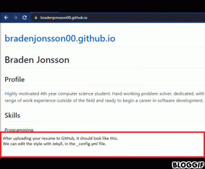

# bradenjonsson00.github.io

This README will describe how to host a resume on github. An integral part of hosting on github is having a good README. The README assoicated with my resume (that you are currently reading), will both explain and demonstrate what a good README is.

You can see my resume [here](bradenjonsson00.github.io).

## Prerequisites

 - Have a GitHub account
 - Install Jekyll

## Introduction

### Modern Technical Writing

The book "Modern Technical Writing: An Introduction to Software Documentation" by Andrew Etter, has heavily influenced the creation of this README, and the resume associated with it. I will be highlighting principles from that book. From here on out I will be refering to it as "MTW" for short.

### Create a static site with Github pages and Jekyll

It is a common practice for people who want to discribute their resume, to do so with PDFs and WORD documents. A better practice is to create a static website. In MTW, Andrew says "You should build and host a website, not distribute PDFs … PDFs get downloaded onto hard drives and then sit there like day-old bagels, growing more and more stale until they're actively harmful. You can never update them.". This is very true, if something relatred to your professional expersience changes, then you will be much better off being able to edit the doccument, no matter when it is.

If you look around you should be able to find a website that will host your resume for free. In MTW, Andrew says "\[Static websites] have no server-side application dependencies, no databases, and nothing to install", thus they are cheap to host, so that barrier is not a concern.

## Instructions

1. To create a resume that you can host on github, first you must create a repository named "[yourusername].github.io".
2. Then create a markdown formatted resume file in that repositroy named "index.md". Once that is created you can see your resume at the URL:"[yourusername].github.io"
Using markdown is an execelant choice for this case. In MTW, Andrew says "[Markdown is] the most widely used lightweight markup language in the world and has the cleanest syntax, but it also has a limited set of features and no defined standard.". I find this to be very true, though the limited set of features isn't an issue, as we are creating a simple doccument. And the "no defined standard isn't an issue, as we are using the GitHub Flavored Markdown, which is more well defined.
3. Then create \_config.yml, Jekyll uses the information found in this file to change the style of your resume.

Here is a demonstration on how to edit your yml file:

5. Then create a README to explain your repository, resume, etc.

#### Misc

"Consistency is king"

## File manifest

 - README.md
 - _config.yml
 - index.md

## More Resources

In MTW, Andrew says to "leverage all the wonderful writing that developers and testers produce". By this he is refering to the various guides, and books that are easily available online. Thus, in this section I have highlighted some useful resources.

Here is a Markdown tutorial: https://www.markdowntutorial.com/
Here is a guide to install Jekyll: https://jekyllrb.com/docs/installation/
Here is an Amazon link to "Modern Technical Writing: An Introduction to Software Documentation" by Andrew Etter:  https://www.amazon.ca/Modern-Technical-Writing-Introduction-Documentation-ebook/dp/B01A2QL9SS
Here is a link to the speceficiations of GitHub flavored markdown: https://github.github.com/gfm/
Here is a link to Typoria, my Markdown editor of choice: https://typora.io/

## Built With

 - I used Typoria to create my resume.
 - I used Github pages to host the resume.
 - I used Jekyll to edit the resume's style.

## FAQs

### Question: Why should I use Github?

Answer: GitHub makes it easy for you to share your work with other people, including for collaberation.

### Question: Why have the Jekyll customizations I have made not shown up yet?

Answer: It can take up to 30 minutes for the changes to take effect.

## Contact Information

 - **Braden Jonsson**

## Acknowledgments
 - Thanks to PurpleBooth's good readme template:

https://github.com/PurpleBooth/a-good-readme-template/edit/main/README.md

- Big thanks to my group members
